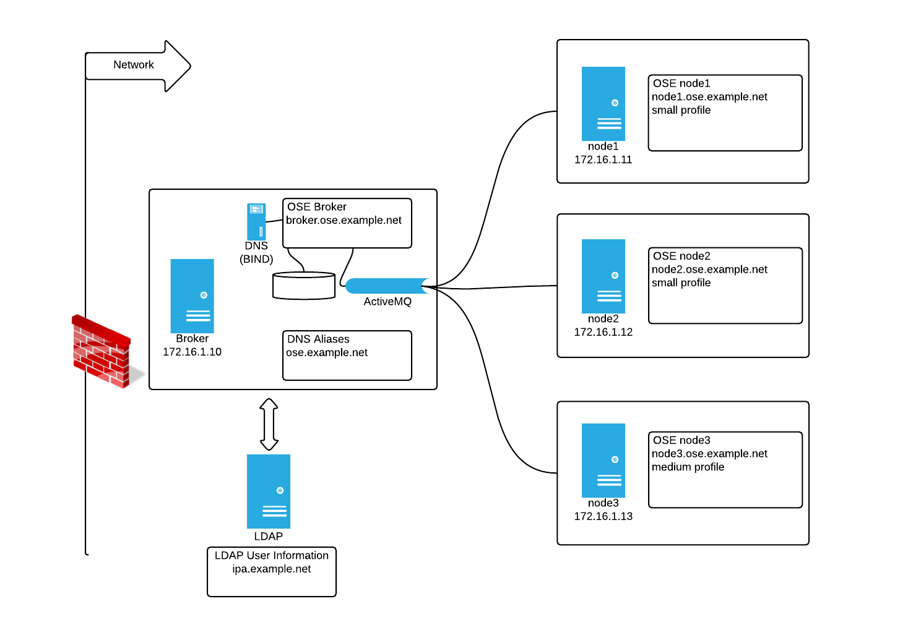

# OpenShift v2

This is an old version of OpenShift and this is here mainly for historical reasons.

# Installation

The installation of OpenShift Enterprise (OSE); will be done via scripts. More information can be found using the Red Hat documentation site.

# Infrastructure

For this installation we have the following

  * ose.example.net domain delegated
  * Broker
    * broker.ose.example.net
    * 172.16.1.10
  * Node1
    * node1.ose.example.net
    * 172.16.1.11
  * Node2 
    * node2.ose.example.net
    * 172.16.1.12
  * Node3
    * node3.ose.example.net
    * 172.16.1.13
  * LDAP Server for User Logins
    * ipa.example.net
    * 172.16.1.153

Servers were installed with the proper hostnames set and proper DNS entries

A map of the infrastructure:




# Broker

First make sure a subdomain was delegated to this server (in this case ose.example.net was delegated.

After registering the system; make sure the right channels are enabled
```
root@broker# subscription-manager repos --disable="*"
root@broker# subscription-manager repos --enable=rhel-6-server-ose-2.2-infra-rpms      
root@broker# subscription-manager repos --enable=rhel-6-server-ose-2.2-rhc-rpms      
root@broker# subscription-manager repos --enable=rhel-6-server-rpms
root@broker# subscription-manager repos --enable=rhel-server-rhscl-6-rpms
```

Install prereqs

```
root@broker# yum -y install ruby unzip curl ruby193-ruby yum-plugin-priorities wget openshift-enterprise-release
```

Make sure the validator returns with no errors (use "--fix-all" if desired)

```
root@broker# oo-admin-yum-validator -r broker -o 2.2 {--fix-all}
```

Once the YUM Validator returns with no errors download the (latest) OpenShift installer script (to get the latest script. Please refer to the RH documentation)

```
root@broker# curl -O https://raw.githubusercontent.com/openshift/openshift-extras/enterprise-2.2/enterprise/install-scripts/generic/openshift.sh
```


Next; based on requirements - run the install script with the desired parameters (example below). Make sure you tee the output to collect mcollective passwords
```
root@broker# chmod +x openshift.sh
root@broker# ./openshift.sh install_components=broker,named,activemq,datastore domain=ose.example.net hosts_domain=ose.example.net named_ip_addr=172.16.1.10 broker_hostname=broker.ose.example.net  broker_ip_addr=172.16.1.10 named_entries=broker:172.16.1.10,activemq:172.16.1.10,node1:172.16.1.11,node2:172.16.1.12,node3:172.16.1.13 valid_gear_sizes=small,medium default_gear_size=small default_gear_capabilities=small 2>&1 | tee -a openshift.sh.inst.log
```

Make sure you save the output as this will output the mcollective password and demo username/password. These could be passwd to the installation script by using "mcollective_password" and "openshift_password1" 


# Node

Before you begin installation. Make sure the SSH Fingerprint is all the same on all nodes. This will save you from the error of "fingerprint mismatch" when you move gears from node to node

On EACH node host, back up all `/etc/ssh/ssh_host_*` files:

```
root@node# cd /etc/ssh/
root@node# mkdir hostkeybackup
root@node# cp ssh_host_* hostkeybackup/.
```

From the first node, copy the /etc/ssh/ssh_host_* files to the other nodes:

```
root@node1# scp /etc/ssh/ssh_host_* node2:/etc/ssh/.
root@node1# scp /etc/ssh/ssh_host_* node3:/etc/ssh/.
```

Restart the SSH service on EACH node host and fix any SELinux labels:

```
root@node# restorecon -vR /etc/ssh
root@node# service sshd restart
```

Enable proper Repos (you might enable different repos depending on the node profile):

```
root@node# subscription-manager repos --disable="*"
root@node# subscription-manager repos --enable=rhel-6-server-ose-2.2-node-rpms	
root@node# subscription-manager repos --enable=jb-eap-6-for-rhel-6-server-rpms
root@node# subscription-manager repos --enable=jb-ews-2-for-rhel-6-server-rpms        
root@node# subscription-manager repos --enable=rhel-6-server-ose-2.2-jbosseap-rpms
root@node# subscription-manager repos --enable=rhel-6-server-rpms                  
root@node# subscription-manager repos --enable=rhel-server-rhscl-6-rpms
```

Install prereqs

```
root@node# yum -y install ruby unzip curl ruby193-ruby yum-plugin-priorities wget openshift-enterprise-release
```

Make sure the validator returns with no errors (bottom example tests a node with EAP on it). Use "--fix-all" if desired. Remember the role (i.e. "-r") of the node might be different. For the example domain I used node-eap

```
root@node# oo-admin-yum-validator -r {node,broker,client,node-eap} -o 2.2 {--fix-all}
```

Once the YUM Validator returns with no errors download the (latest) OpenShift installer script

```
root@node# curl -O https://raw.githubusercontent.com/openshift/openshift-extras/enterprise-2.2/enterprise/install-scripts/generic/openshift.sh
```

Next; based on node requirements - run the install script with the desired parameters (example below). Use the output of the broker to add the mcollective password. Also, for the "node_profile". It might differ depending on what kind of node you're installing.

```
root@node# chmod +x openshift.sh
root@node# ./openshift.sh install_components=node mcollective_password=luBW5vnq2lFkvHguxTNo5zEGB2M domain=ose.example.net hosts_domain=ose.example.net node_hostname=node1.ose.example.net named_ip_addr=172.16.1.10 broker_hostname=broker.ose.example.net node_ip_addr=172.16.1.11 node_profile={small,medium,large,xpaas} cartridges=all 2>&1 | tee -a openshift.sh.inst.log
```

# Post Installation Steps

On the broker; run the `oo-mco ping` command to see if the mcollective communication is set up correctly. This should return a response from all the nodes.

```
root@broker# oo-mco ping
```

Next, after you recieve a response from the command; run the post deploy script on the broker. This adds the districts and adds available (eligeble) nodes

```
root@broker# ./openshift.sh actions=post_deploy default_districts=false broker_hostname=broker.ose.example.net district_mappings="small:node1.ose.example.net,node2.ose.example.net;medium:node3.ose.example.net" 2>&1 | tee -a openshift.sh.post.log
```

NOTE: You can tell the script to do all of it for you using `./openshift.sh actions=post_deploy broker_hostname=broker.ose.example.net default_districts=true`

On the node(s), download the ssh key for the broker

```
root@node# wget -O- --no-check-certificate https://broker/rsync_id_rsa.pub >> /root/.ssh/authorized_keys
```

You probably want to run `oo-diag` on both node and broker
```
root@{node|broker}# oo-diagnostics
```
# Adding Profile w/ District

On the broker, Edit the `/etc/openshift/broker.conf` and add valid gear sizes

```
root@broker# grep -w VALID_GEAR_SIZES /etc/openshift/broker.conf
VALID_GEAR_SIZES="small,medium"
```

On the node, make sure the proper `/etc/openshift/resource_limits.conf`  file is set up to the right profile (there are "pre canned" resource_limits files to help out...usually the install script uses the right one so just verify)

```
root@node3# grep -w node_profile /etc/openshift/resource_limits.conf
node_profile=medium
```

Restart the mcollective service once you've verified the proper entries in the `resource_limits.conf` file.

```
root@node3# service ruby193-mcollective restart
```

On the broker; create the district

```
root@broker# oo-admin-ctl-district -c create -n default-medium -p medium
```

Add the node to the district

```
root@broker# oo-admin-ctl-district -c add-node -n default-medium -i node3.ose.example.net
```

*NOTE*: The above could be done in one command if you choose to do so

```
root@broker# oo-admin-ctl-district -c add-node -n default-medium -p medium -i node3.ose.example.net
```

Restart the broker

```
root@broker# service openshift-broker restart
```

You'll probably want to add the capabilities to the user

```
root@broker# oo-admin-ctl-user -l demo --addgearsize medium
```

# User Management

There are a veriety of ways to manage users on OSE. By default Apache/HTPasswd is used; but there is support for LDAP, Kerberos, and AD

# HTPASSWD

User authentication on OpenShift Enterprise with the standard remote user authentication plug-in uses Apache HTTP Server authentication methods. When a user is successfully authenticated for the first time, the broker host creates a user record in MongoDB. Therefore use the htpasswd command to create new users

```
root@broker# htpasswd -c /etc/openshift/htpasswd username
```

Once the htpasswd file is seeded you can add additional users by ommitting the `-c` option

```
root@broker# htpasswd /etc/openshift/htpasswd otheruser
```

You can have users generate thier own passwords using the `htpasswd` command and have them send you the output to include in the file

```
bob@client$ htpasswd -n bob
  New password: ******
  Re-type new password: ******
  bob:GO1gWc3j82Sxs
```

Once the user is logged in you can use the following command from the broker for user management (note this just creates and adds fuctionality for OSE. Authentication is handled externally via htpasswd or LDAP)

```
root@broker# oo-admin-ctl-user
```

# LDAP

Since OSE supports any form of Apache authentication capable of setting the REMOTE_USER Apache environment variable securely. The following sections provide details on configuring user authentication on the broker for a number of popular authentication methods.  Including LDAP!

First you must edit the `/var/www/openshift/broker/httpd/conf.d/openshift-origin-auth-remote-user.conf` file to support LDAP. OSE uses the Apache module `mod_authnz_ldap` for support in authenticating to directory servers; you can use the example configuration provided.

```
root@broker# cd /var/www/openshift/broker/httpd/conf.d/
root@broker# cp openshift-origin-auth-remote-user.conf openshift-origin-auth-remote-user.conf.bak
root@broker# cp openshift-origin-auth-remote-user-ldap.conf.sample openshift-origin-auth-remote-user.conf
```

Here is an example of the edits when connecting to an IPA server (the BindDN doesn't have to be an Admin account...just an account that can do basic queries)

```
AuthName "OpenShift Enterprise"
AuthType Basic
AuthBasicProvider ldap
AuthLDAPURL ldap://ipa.example.net:389/cn=users,cn=accounts,dc=example,dc=net?uid
AuthLDAPBindDN "cn=directory manager"
AuthLDAPBindPassword secret
Require valid-user
AuthName "OpenShift Enterprise"
```

Do the same for the console

```
root@broker# cd /var/www/openshift/console/httpd/conf.d 
root@broker# cp openshift-origin-auth-remote-user.conf openshift-origin-auth-remote-user.conf.bak
root@broker# cp openshift-origin-auth-remote-user-ldap.conf.sample openshift-origin-auth-remote-user.conf
AuthName "OpenShift Enterprise"
AuthType Basic
AuthBasicProvider ldap
AuthLDAPURL ldap://ipa.example.net:389/cn=users,cn=accounts,dc=example,dc=net?uid
AuthLDAPBindDN "cn=directory manager"
AuthLDAPBindPassword secret
Require valid-user
```

Then clear the cache and restart the broker service

```
root@broker# oo-admin-broker-cache --clear
root@broker# service openshift-broker restart
root@broker# service openshift-console restart
root@broker# service httpd restart
```

**//__NOTE:__//** You can use BOTH `file` and `ldap` for authentication. You just need to set the configuration like this

```
AuthName "OpenShift Enterprise"
AuthType Basic
AuthBasicProvider file ldap
AuthUserFile /etc/openshift/htpasswd
###AuthzLDAPAuthoritative off 
AuthLDAPURL ldap://ipa.example.net:389/cn=users,cn=accounts,dc=example,dc=net?uid
AuthLDAPBindDN "cn=directory manager"
AuthLDAPBindPassword secret
Require valid-user
```

Just make sure you have the `mod_authn_file` loaded on top of the file...

```
LoadModule authn_file_module modules/mod_authn_file.so
```

# Misc Notes

Random OSE Notes in no particular order

# Adding Node To Existing Infrastructure

The steps to add a node to an existing infrastructure are

* Create a DNS entry for the node
* Install the Node
* Add the node to a 

# Removing User Applications

NOTE: This procedure deletes all the data for the selected application and cannot be reversed. 

Stop the application by running the following command on the broker host

```
root@broker# oo-admin-ctl-app -l username -a appname -c stop
```

Delete the application

```
root@broker# oo-admin-ctl-app -l username -a appname -c destroy
```

If the stop and destroy commands fail, you can force-stop and force-remove it. The force- commands do not wait for the proper shutdown sequence, so should only be used if the standard commands fail

```
root@broker# oo-admin-ctl-app -l username -a appname -c force-stop
root@broker# oo-admin-ctl-app -l username -a appname -c force-destroy
```

# Removing User Data

Remove a former user's application and domain data if they are no longer required. Again, The following procedure removes all of a user's application data from the system and cannot be reversed. 

Prevent the user from creating more gears by running the following command on the broker host

```
root@broker# oo-admin-ctl-user -l username --setmaxgears 0
```

Retrieve the user's domain and application names

```
root@broker# oo-admin-ctl-domain -l username | egrep -i '^name:|^Namespace:'
```

Remove the user's applications by running the following commands for each application found in the previous step

```
root@broker# oo-admin-ctl-app -l username -a app1 -c stop
root@broker# oo-admin-ctl-app -l username -a app1 -c destroy
```

Use the force-destroy parameter to remove particularly troublesome applications

```
root@broker# oo-admin-ctl-app -l username -a app1 -c force-destroy
```

Delete the user's domain

```
root@broker# oo-admin-ctl-domain -l username -c delete -n testdomain
```

The user's application data is now removed and the user cannot create any new applications; the account is effectively deactivated. To reactivate a user's account, set the maximum amount of gears to a desired amount. Note that the --setmaxgears option may be restricted based on the user's configuration settings

```
root@broker# oo-admin-ctl-user -l username --setmaxgears 5
```

# Removing A User

Use the oo-admin-ctl-domain command to remove a user from an OpenShift Enterprise environment:

```
root@broker# oo-admin-ctl-domain -l username -c delete
```

NOTE: The `oo-admin-ctl-domain` command deletes the user from the OpenShift Enterprise datastore, but does not delete user credentials stored on external databases such as LDAP or Kerberos. 

# Moving Gears Between Nodes

First, determine what the uuid of the gear is. You can do this my searching for "uuid" within less of the oo-admin-ctl-domain command

```
root@broker#  oo-admin-ctl-domain -l user | less
```

Next, use the oo-admin-move command to move the gear to a node in the same district

```
root@broker# oo-admin-move --gear_uuid 5480c40bac2c4a2cd2000007 -i node2.ose.example.net
```

# Remove Nodes from Districts

The following steps demonstrate an example situation where district small_district has two node hosts, node1.example.com and node2.example.com. The second node host, node2.example.com, has a high number of idle gears.

Run the following commands and fix any problems that are found. This prevents future problems caused by moving a broken gear. On the broker host, run

```
root@broker# oo-admin-chk
```

On the node hosts, run

```
root@node# oo-accept-node
```

Deactivate the node you want to remove to prevent applications from being created on or moved to the node. Existing gears continue running. On the broker host, run

```
root@broker# oo-admin-ctl-district -c deactivate-node -n small_district -i node2.example.com
```

Move all the gears from node2.example.com to node1.example.com by repeating the following command on the broker host for each gear on node2.example.com

```
root@broker# oo-admin-move --gear_uuid UUID -i node1.example.com
```

Remove node2.example.com from the district

```
root@broker# oo-admin-ctl-district -c remove-node -n small_district -i node2.example.com
```

# Crete Scaled App

To create a scaled app you must pass the "-s" at creation (you can see the status by going to your $URL/haproxy-status/ page)

```
user@client$ rhc create-app -a sphp -t php-5.5 -s
```

Now Set the default number of gears behind the HAProxy. First show the status; then make your change (you can also do this from the console)

```
user@client$ rhc app show -a sphp
user@client$ rhc cartridge-scale php-5.3 -a sphp --min 2 --max 10
```

# Making Apps Highly Available

First enable HA on the broker

```
root@broker# grep -w ALLOW_HA_APPLICATIONS /etc/openshift/broker.conf
ALLOW_HA_APPLICATIONS="true"
root@broker# service openshift-broker restart
```

Make sure the user can create HA Application

```
root@broker# oo-admin-ctl-user -l christian --allowha true
```

Now make the application HA

```
user@client$ rhc app enable-ha $appname
```

# Adding Cartridge

Add the mysql cartridge to your php application

```
user@client$ rhc cartridge add mysql-5.5 --app helloworld
```

Use port forwarding to connect to your db

```
user@client$ rhc port-forward helloworld
user@client$ mysql -u adminNqSURE8 -h 127.0.0.1 -p
```

Conversely you can do it via ssh

```
user@client$ rhc ssh -a helloworld
[helloworld-christian.ose.example.net 5480c40bac2c4a2cd2000007]\> mysql
mysql> 
```

Make sure you use Env variables to connect to your mysql db

```
user@client$ cat index.php
$dbhost = getenv("OPENSHIFT_MYSQL_DB_HOST");
$dbport = getenv("OPENSHIFT_MYSQL_DB_PORT");
$dbuser = getenv("OPENSHIFT_MYSQL_DB_USERNAME");
$dbpass = getenv("OPENSHIFT_MYSQL_DB_PASSWORD");
$dbname = getenv("OPENSHIFT_APP_NAME");
$conn = mysql_connect($dbhost . ":" . $dbport, $dbuser, $dbpass);
if(! $conn )
{
die('Could not connect: ' . mysql_error());
}

$sql = "INSERT INTO history ".
"( timestamp, roll ) ".
"VALUES( NOW(), $numdice )";
mysql_select_db($dbname);
$retval = mysql_query( $sql, $conn );
if(! $retval )
{
die('Could not enter data: ' . mysql_error());
}

mysql_close($conn);
```


NOTE: I created this by doing this on the DB connection (via the port-forwarding or not)

```
[helloworld-christian.ose.example.net 5480c40bac2c4a2cd2000007]\> mysql
mysql> connect hellowrold;
mysql> CREATE TABLE history (timestamp TIMESTAMP,  roll int);
```

# Creating DNS Entries

To add a DNS entry from the broker

```
root@broker# oo-register-dns -h node2 -d ose.example.net -n 172.16.1.12
```

Once you've ran this; test it on the broker with a dig command

```
root@broker# dig @localhost node2.ose.example.net +short
```

# Changing Gear UIDs

If you would like to change the UID/GUID on the gear user...

Set max/min in the /etc/openshift/node.conf file on all nodes and restart mcollective

```
root@node# egrep 'GEAR_MIN_UID|GEAR_MAX_UID' /etc/openshift/node.conf 
GEAR_MIN_UID=11000
GEAR_MAX_UID=16999
root@node /etc/init.d/ruby193-mcollective restart
```

Set start DISTRICTS_FIRST_UID in the /etc/openshift/plugins.d/openshift-origin-msg-broker-mcollective.conf file on the broker

```
root@broker# grep DISTRICTS_FIRST_UID /etc/openshift/plugins.d/openshift-origin-msg-broker-mcollective.conf
DISTRICTS_FIRST_UID=11000
```


On all of the nodes make sure you run the "oo-gear-firewall" utility to make sure firewall/selinux enabled along with the begin/end UUID setup

```
root@node# oo-gear-firewall -s enable -b 11000 -e 16999 -i enable
```

**__//YOU MUST RECREATE DISTRICTS//__**

# Mapping Framework to Geasize

Sometimes you ONLY want fuse to run on an `xpaas` district. In order to do this mapping you have to edit the `/etc/openshift/broker.conf` file to look something like this

```
VALID_GEAR_SIZES_FOR_CARTRIDGE="fuse-6.1.1|xpaas fuse-builder-1.0.0|xpaas amq-6.1.1|xpaas cron-1.4|small,medium jenkins-client-1|small,medium mongodb-2.4|small,medium mysql-5.1|small,medium mysql-5.5|small,medium postgresql-8.4|small,medium postgresql-9.2|small,medium diy-0.1|small,medium jbosseap-6|small,medium,xpaas jbossews-1.0|small,medium,xpaas jbossews-2.0|small,medium,xpaas jenkins-1|small,medium nodejs-0.10|small,medium perl-5.10|small,medium php-5.3|small,medium php-5.4|small,medium python-2.6|small,medium python-2.7|small,medium python-3.3|small,medium ruby-1.8|small,medium ruby-1.9|small,medium ruby-2.0|small,medium haproxy-1.4|small,medium"
```

Syntax is `cartridge|size,size`

YMMV

# Logout Link

You can set up a logout link on OSE by editing the `/etc/openshift/console.conf` file and adding/editing the following entry

```
LOGOUT_LINK="https://ose2.example.net/console"
```
