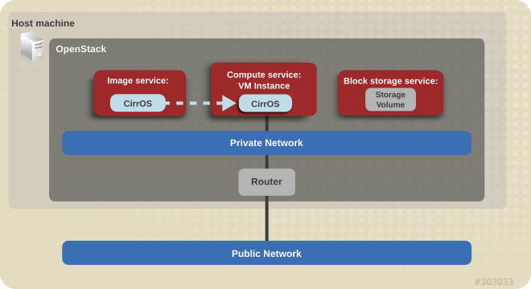

# RHOSP 13

This is an overview on how to install OpenStack all-in-one setup.

* [Overview](#overview)
* [Install](#install)
* [Host Setup](#host-setup)
* [OpenStack Setup](#openstack-setup)
* [Cinder Storage](#cinder-storage)
* [Notes](#notes)

## Overview

We will be installing an "allinone" installation of RHOSP. In general, it kind of looks like this



## Install

Register

```
subscription-manager register
```

Attach to proper pool

```
subscription-manager attach --pool=POOL_ID
```

Enable the proper entitlements

```
subscription-manager repos --disable=*  
subscription-manager repos --enable=rhel-7-server-rpms
subscription-manager repos --enable=rhel-7-server-rh-common-rpms
subscription-manager repos --enable=rhel-7-server-extras-rpms
subscription-manager repos --enable=rhel-7-server-openstack-13-rpms
subscription-manager repos --enable=rhel-7-server-openstack-13-devtools-rpms
```

Install Packages

```
yum -y install yum-utils
yum -y update
systemctl disable NetworkManager
systemctl disable firewalld
systemctl enable network
systemctl reboot
```

Install OSP rpms

```
yum install -y openstack-packstack python-netaddr
```

Install an all-in-one RHOSP (if the below doesn't work for you try `packstack --allinone --provision-ovs-bridge=n` ...but the below worked for me on OSP13)

```
packstack --allinone  --provision-demo=n --os-neutron-ovs-bridge-mappings=physnet1:br-ex --os-neutron-ml2-type-drivers=vxlan,flat
```

The all-in-one installation creates an `admin` user. To view passwords for later use, run:

```
grep OS_PASSWORD /root/keystonerc_admin    
```

## Host Setup

Before we work in Horizon let's first make some changes to our network interfaces on the OpenStack host.

```
[root@rhosp ~]# cat /etc/sysconfig/network-scripts/ifcfg-br-ex
DEVICE=br-ex
DEVICETYPE=ovs
TYPE=OVSBridge
BOOTPROTO=static
IPADDR=172.16.1.20
NETMASK=255.255.255.0
GATEWAY=172.16.1.1
DNS1=172.16.1.254
DNS2=8.8.8.8
DOMAIN=example.com
ONBOOT=yes
# You may NOT need this below unless you're running in KVM
# Find out the mac addr with `ip link show dev eth0`
MACADDR=52:54:00:5d:5f:ca
OV_EXTRA="set bridge $DEVICE other-config:hwaddr=$MACADDR"
```


Now we edit the physical interface config file
```
[root@rhosp ~]# cat /etc/sysconfig/network-scripts/ifcfg-eth0
NAME=eth0
DEVICE=eth0
HWADDR=52:54:00:e7:8b:aa
TYPE=OVSPort
DEVICETYPE=ovs
OVS_BRIDGE=br-ex
ONBOOT=yes
```

Next add the following to the `/etc/neutron/plugin.ini` file. 
```
network_vlan_ranges = physnet1
bridge_mappings = physnet1:br-ex
```

Reboot To verify
```
systemctl reboot
```

## OpenStack Setup

__1. Remove existing networking__

Okay, now we setup our OpenStack networking to connect to our external network. **First**, from Horizon or the command line, delete all networks, ports and routers it created by default. We will recreate our own private and public networks. (**NOTE** I didn't have to do this for OSP13)

__2. Edit drivers__

Next edit your `/etc/neutron/plugins/ml2/ml2_conf.ini` file and make the following changes
```
type_drivers = local,flat,vlan,gre,vxlan
```
__3. Create networking__

Next commands create a new router named "router", a private and public network and a private subnet and a public subnet, then we set the default gateway for our router. For the public network I assign a range of IPs my home DHCP server does not assign to, so just make sure there is not an IP conflict with the IPs you're assigning here and your external network. 

```
[root@rhosp ~]# . keystonerc_admin 

[root@rhosp ~(keystone_admin)]# neutron router-create router
[root@rhosp ~(keystone_admin)]# neutron net-create private
[root@rhosp ~(keystone_admin)]# neutron subnet-create private 10.254.254.0/24 --name private_subnet
[root@rhosp ~(keystone_admin)]# neutron router-interface-add router private_subnet
[root@rhosp ~(keystone_admin)]# neutron net-create public --router:external=True --provider:network_type flat --provider:physical_network physnet1
[root@rhosp ~(keystone_admin)]# neutron subnet-create public 172.16.1.0/24 --name public_subnet --enable_dhcp=False --allocation-pool start=172.16.1.30,end=172.16.1.39 --gateway=172.16.1.1
[root@rhosp ~(keystone_admin)]# neutron router-gateway-set router public
```
 __4. Profit__
 
That's it. Allow ICMP and SSH to your default security group in the Access & Security section in Horizon. You should now be able to spin up a new instance using the included cirros image to test this. On the Networking tab, only assign a private IP. We will be allocating a floating IP to our project, then assigning this floating IP to this instance for external access.

## Cinder Storage

If you have a specific storage you want to use

Delete volume group/pv
```
[root@rhosp ~]# vgs
  VG             #PV #LV #SN Attr   VSize  VFree 
  cinder-volumes   1   0   0 wz--n- 20.60g 20.60g
  rhel_rhosp       1   2   0 wz--n- 49.51g 40.00m
[root@rhosp ~]# vgremove cinder-volumes
  Volume group "cinder-volumes" successfully removed
[root@rhosp ~]# pvs
  PV         VG         Fmt  Attr PSize  PFree 
  /dev/loop1            lvm2 ---  20.60g 20.60g
  /dev/vda2  rhel_rhosp lvm2 a--  49.51g 40.00m
[root@rhosp ~]# pvremove /dev/loop1
  Labels on physical volume "/dev/loop1" successfully wiped.
```

Create new cinder volume
```
[root@rhosp ~]# vgcreate cinder-volumes /dev/vdb
  Physical volume "/dev/vdb" successfully created.
  Volume group "cinder-volumes" successfully created
[root@rhosp ~]# vgs
  VG             #PV #LV #SN Attr   VSize  VFree 
  cinder-volumes   1   0   0 wz--n- 50.00g 50.00g
  rhel_rhosp       1   2   0 wz--n- 49.51g 40.00m
```

Then reboot

## Notes

__Floating IPs__

When you add a floating IP to an instance, it won't show the interface inside the instances with "ip a" or "ifconfig". So it's best to view/manage these using the nova client.

```
shane@ubuntu-devbox:~$ nova list

+--------------------------------------+---------+--------+------------+-------------+---------------------------------+
| ID | Name | Status | Task State | Power State | Networks |
+--------------------------------------+---------+--------+------------+-------------+---------------------------------+
| d17cf973-3920-4622-a64f-bfeb1bdd080e | devbox1 | ACTIVE | None | Running | private=10.0.0.2                          |
| 92170264-c474-4e21-9256-5f9e1672c858 | devbox2 | ACTIVE | None | Running | private=10.0.0.4, 192.168.1.202           |
+--------------------------------------+---------+--------+------------+-------------+---------------------------------+
```

Everything you can do in Horizon you should be able to do at the command line using OpenStack tools on the host. Each OpenStack service has it's own set of tools to configure that service. Also, you can use the various OpenStack clients to manage your infrastructure and spin up/down resources. For example, from one of my other servers or laptop I can manage my own OpenStack deployment and I can also use these same clients (with different credentials of course) to manage my Rackspace infrastructure since they are also based on OpenStack.

This is my personal OpenStack credentials file I used to list my two servers above after installing python-novaclient.

```
shane@ubuntu-devbox:~$ cat .myopenstack

export OS_USERNAME=admin
export OS_PASSWORD=keystoneadminpassword
export OS_TENANT_NAME=admin
export OS_AUTH_URL=http://192.168.1.75:35357/v2.0/
export NOVACLIENT_DEBUG=1
export NOVA_VERSION=2
```

__DNS__

To setup the DNS that it gives out to the instances...first get your private subnet id

```
[root@rhosp ~(keystone_admin)]# neutron net-list
+--------------------------------------+---------+----------------------------------+------------------------------------------------------+
| id                                   | name    | tenant_id                        | subnets                                              |
+--------------------------------------+---------+----------------------------------+------------------------------------------------------+
| 58f5d4be-c083-4558-8afb-807529a7addb | public  | 0bdb127e80c64c68926fe2b0450822ce | bcb709d5-16e8-49e9-816c-40cd1bf6465f 172.16.1.0/24   |
| ea2c4bc3-d5bf-4c83-808b-3f23509fba5c | private | 0bdb127e80c64c68926fe2b0450822ce | 639f199f-e140-4361-a608-766529ef2c8b 10.254.254.0/24 |
+--------------------------------------+---------+----------------------------------+------------------------------------------------------+
```

Then update it

```
 neutron subnet-update --dns-nameserver  8.8.8.8  639f199f-e140-4361-a608-766529ef2c8b
```
