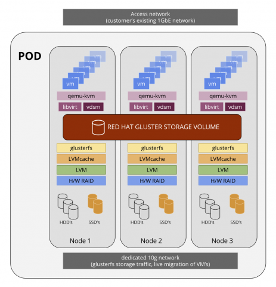

# RHEV Notes

RHEV Is Red Hat's Virtualization platform. It's comparable to VMWare.

* [Red Hat Hyperconverged Infrastructure](#rhhi-notes)
* [Create RHEL Template](#create-rhel-template)
* [P2V Migration](#p2v-migration)
* [Manual P2V](#manual-p2v)
* [RHEVM CLI](#rhevm-cli)
* [Misc RHEVM Notes](#misc-rhevm-notes)
* [RHEVM REST API](#rhevm-rest-api)
* [Dell iDrac Info](#dell-idrac-info)

## RHHI Notes

Red Hat Hyperconverged Infrastructure (RHHI) combines compute, storage, networking, and management capabilities in one deployment. In short this makes it to where the Hypervisors are actually running the storage as well. The design looks like this.



The prereqs are as follows:

* 3 Servers able to do virt
* Each server must have at LEAST 2 NICs (one for vm network and one for storage network)
* Each server must have at LEAST 2 Hard Drives (one for the Hypervisor OS and the other for Gluster)
* 12 Core CPU
* 64GB of RAM

The following steps will get you up and running.

* [Prepare The Hosts](##prepare-the-hosts)

## Prepare the Hosts

I installed `RHEL 7.4` on each one of my hosts with the following repos enabled

```
[root@hyperX ~]# yum repolist
Loaded plugins: enabled_repos_upload, package_upload, product-id, search-disabled-repos, subscription-manager, vdsmupgrade
repo id                                                                             repo name                                                                          status
!rh-gluster-3-for-rhel-7-server-rpms                                                rh-gluster-3-for-rhel-7-server-rpms                                                   884
!rhel-7-server-ansible-2-rpms                                                       rhel-7-server-ansible-2-rpms                                                           33
!rhel-7-server-rhv-4-mgmt-agent-rpms                                                rhel-7-server-rhv-4-mgmt-agent-rpms                                                 1,391
!rhel-7-server-rhv-4.2-manager-rpms                                                 rhel-7-server-rhv-4.2-manager-rpms                                                    471
!rhel-7-server-rpms                                                                 rhel-7-server-rpms                                                                 20,920
repolist: 23,699

```


## Create RHEL Template

Once you have installed and configured a RHEL/CentOS (maybe enven Fedora?) Server. You can make it a template so that you can create copies of the same machine.

First mark the server as "unconfigured"

```
root@host# touch /.unconfigured
```

Next remove the SSH keys/fingerprints

```
root@host# rm -rf /etc/ssh/ssh_host_*
```

Now (for ease of use) remove all networking directives. under `/etc/sysconfig/network-scripts/ifcfg-eth0` The file should look something like this afterwards.

```
DEVICE="eth0"
TYPE=Ethernet
NM_CONTROLLED="yes"
ONBOOT=yes
IPV6INIT=no
BOOTPROTO=none
DEFROUTE=yes
IPV4_FAILURE_FATAL=yes
NAME="System eth0"
IPADDR=
PREFIX=24
GATEWAY=
DNS1=
DNS2=
DOMAIN=
```

I like to leave the "MUST SET" settings. Please make note to REMOVE the `HWADDR=` line!

Now make sure you remove the hostname under the `/etc/sysconfig/network` file. It should like something like this.

```
HOSTNAME=
NETWORKING=yes
```

Now in the `/etc/udev/rules.d/70-persistent-net.rules` file remove the `SUBSYSTEM` line (the one containing the `eth0` line). It should look something like this

```
# This file was automatically generated by the /lib/udev/write_net_rules
# program, run by the persistent-net-generator.rules rules file.
#
# You can modify it, as long as you keep each rule on a single
# line, and change only the value of the NAME= key.

# PCI device 0x1af4:0x1000 (virtio-pci)

#
##
```

Now you can shutdown the machine.

```
root@host# shutdown -h now
```

Now in the RHEV-M Web interface; you can make a template using the GUI tools.

### RHEL 7 Temlate

These are ADDITIONAL steps

(RHEL only...not CentOs)

```
yum install initial-setup　
```

```
touch /etc/reconfigSys
```

```
systemctl enable initial-setup-graphical.service
```

OR

```
systemctl enable initial-setup-text.service
```

```
cat /dev/null > /etc/machine-id
```

```
subscription-manager ungregister
subscription-manager remove --all
subscription-manager clean
poweroff
```

## P2V Migration

There is an ISO you can load up on the machine to do this "automatically", more [information can be found here](https://access.redhat.com/knowledge/docs/en-US/Red_Hat_Enterprise_Virtualization/3.1/html/V2V_Guide/P2V_Migration_Moving_workloads_from_Physical_to_Virtual_Machines-Preperation_Before_the_P2V_Migration.html#Preperation_Before_the_P2V_Migration-Install_virt_v2v_on_V2V_host)

Pretty good how to there, here is a sample `/etc/virt-v2v.conf` file that I used

```
<profile name="exampleP2V">
  <method>rhev</method>
  <storage format="raw" allocation="preallocated">
  storage.rhevm.example.com:/vmdata/VMEXPORT
  </storage>
  <network type="default">
  <network type="network" name="MISC_SERVING"/>
  </network>
  </profile>
</virt-v2v>
```

Remember to create the export "storage domain" on RHEV-M server before booting the node from the  `rhel-6.3-p2v.iso` image.

## Manual P2V

In some cases the physical machines will simply won't convert over for whatever reason. In this case we can use a "dump and restore" method.

First you must install the `dump` utility on the server as it's probably not installed (via YUM or RPM).

Things to have

* NFS Server
* Linux Live CD (Pref EL 6+)
* Patience

In this example; the server only has 2 partition. Root and Swap (so change accordingly for servers with multi partitions/discs)

First `dump` (backup) the server

```
root@host# dump 0ufb /path/to/nfs/mount/hostname_bak.dmp 126 /
```

Once this is done; create an "empty" VM (make a VM with an HD big enough but don't install an OS on it). Format it

```
root@host# fdisk /dev/vda
.
.
.
root@host# mkfs.ext3 /dev/vda1
root@host# mkswap /dev/vda2
```

Now `restore` your backup onto the VM

```
root@host# mount.nfs nfs-server:/path/to/export /tmp/backup
root@host# mount /dev/vda1 /tmp/recovery
root@host# cd /tmp/recovery
root@host# restore -rf /path/to/nfs/mount/hostname_bak.dmp -b 126
```

Now you have to install grub...you have to change what "disc" since it has changed.

```
root@host# chroot /tmp/recovery
root@recovery# vi /boot/grub/device.map
               (hd0) /dev/vda
root@recovery# grub-inistall /dev/vda
root@recovery# exit
```


OR/AND from the live CD

```
root@recovery# mount /dev/vda2 /mnt/recovery
root@recovery# mount /dev/vda1 /mnt/recovery/boot
root@recovery# vi /mnt/recovery/boot/grub/device.map
               (hd0) /dev/vda
root@recovery# grub-inistall --root-directory=/mnt/recovery /dev/vda
```


Create a new initrd file since you'll need to load virtualization drivers.

```
root@host# mount --bind /proc /tmp/recovery/proc
root@host# mount --bind /dev /tmp/recovery/dev
root@host# mount --bind /sys /tmp/recovery/sys
root@host# chroot /tmp/recovery
root@recovery# cd /boot
root@recovery# mv initrd-2.6.18-194.26.1.el5.img ,initrd-2.6.18-194.26.1.el5.img
root@recovery# mkinitrd --with virtio_pci --with virtio_blk initrd-2.6.18-194.26.1.el5.img $(uname -r)
```

If `$(uname -r)` isn't working for you; try using the name found by doing

```
root@recovery# ls -1 /lib/modules
2.6.18-194.26.1.el5
```

That's it! You may have to boot into single user mode or do some more editing of files to get it to boot (i.e. `/etc/fstab` )

## RHEVM CLI

Connecting

To connect; you may want to use the "insecure" method if you don't know/have the SSL key.

```
root@rhevm# rhevm-shell --url=rhevm.example.com:8443 --username=admin@internal --password=minus273 --insecure
```

Sending Commands

At the time of this writing; you can only "Pass commands" with a "here" file (basic EOF) syntax

```
root@rhevm# rhevm-shell --url=rhevm.example.com:8443 --username=admin@internal --password=minus273 --insecure  <<-EOF
show vm wolf3
EOF
```

I created a snapshot with this command

```
root@rhevm# rhevm-shell --url=rhevm.example.com:8443 --username=admin@internal --password=minus273 --insecure  <<-EOF
add snapshot --vm-identifier montools2 --description 'Montools2 Snapshot'
EOF
```

## Misc RHEVM Notes


In the future when RHEV-M adds the ability to "hot add" memory - you may need to make the guest "see" the new RAM.

**Note: These instructions work for RHEL and CentOS. Other distributions may be different.**

Run this command to check the state of the memory, looking for memory that appears offline

```
root@host# grep line /sys/devices/system/memory/*/state
```

If memory appears as offline, set it to online with the command:

```
root@host# echo online > /sys/devices/system/memory/memory[number]/state
```

To Add ISOs to ISO Domain

First list what's available

```
root@rhevm# # rhevm-iso-uploader -u admin@internal list
Please provide the REST API password for the admin@internal RHEV-M user (CTRL+D to abort):
ISO Storage Domain Name   | Datacenter                | ISO Domain Status
GLNISO                    | GLN                       | active
```

Then upload to the desired domain

```
root@rhevm# rhevm-iso-uploader -u admin@internal -i GLNISO upload Fedora-18-x86_64-netinst.iso
```

You can add an IPA domain so you can use the usernames for the system

```
root@rhevm# rhevm-manage-domains -action=add -domain=example.com -user=admin@EXAMPLE.COM -provider=IPA -interactive
root@rhevm#  /etc/init.d/ovirt-engine restart
root@rhevm# rhevm-manage-domains -action=list
Domain: example.com
	User name: admin@EXAMPLE.COM
	This domain is a remote domain.
Manage Domains completed successfully
```

Fence RHEV VM

You can "fence" (power plug pull) a RHEV VM from the command line (from any server)

Install Packages
```
root@host# yum -y install fence-agents
```

Fence a server
```
root@host# fence_rhevm -o status -z -a rhevm.example.com -u 8443 -l 'admin@internal' -p 'minus273' -n w1.gln.example.com
```

The `--help` option is good enough to get you going

## RHEVM REST API

Rough Notes

```
Get Cert
----
curl -o rhevm.cer -k https://rhevm.example.com:8443/ca.crt

GET
----
curl -X GET -H "Accept: application/xml" -u "admin@internal:minus273"  --cacert rhevm.cer https://rhevm.example.com:8443/api/networks
curl -X GET -H "Accept: application/xml" -u "admin@internal:minus273"  --cacert rhevm.cer https://rhevm.example.com:8443/api/datacenters
curl -X GET -H "Accept: application/xml" -u "admin@internal:minus273"  --cacert rhevm.cer https://rhevm.example.com:8443/api/clusters


POST
----
curl -X POST -H "Accept: application/xml" -H "Content-Type: application/xml" -u "admin@internal:minus273" --cacert rhevm.cer -d "<action/>" https://rhevm.example.com:8443/api/hosts/b2161c48-eb22-11e1-a715-37256033ccf9/approve

curl -X POST -H "Accept: application/xml" -H "Content-Type: application/xml" -u "admin@internal:minus273" --cacert rhevm.cer -d "<storage_domain><name>data1</name><type>data</type><storage><type>nfs</type><address>192.168.0.10</address><path>/data1</path></storage><host><name>hypervisor</name></host></storage_domain>" https://rhevm.example.com:8443/api/hosts/b2161c48-eb22-11e1-a715-37256033ccf9/approve
^ The API creates a NFS data storage domain called data1 with an export path of 192.168.0.10:/data1 and sets access to the storage domain through the hypervisor host

curl -X POST -H "Accept: application/xml" -H "Content-Type: application/xml" -u "admin@internal:minus273" --cacert rhevm.cer -d "<vm><name>chrishtest</name><cluster><name>VLAN3</name></cluster><template><name>BaseCentOS64_VLAN3</name></template><type>server</type><memory>1073741824</memory><nic><interface>virtio</interface><name>nic1</name></nic></vm>" https://rhevm.example.com:8443/api/vms

curl -X POST -H "Accept: application/xml" -H "Content-Type: application/xml" -u "admin@internal:minus273"  --cacert rhevm.cer -d "<action><vm><os><boot dev='hd' /></os></vm></action>" https://rhevm.example.com:8443/api/vms/ab99b0d0-4893-466e-b0c4-66a09dd627a1/start


DELTE
----
curl -X DELETE -H "Accept: application/xml" -u "admin@internal:minus273"  --cacert rhevm.cer https://rhevm.example.com:8443/api/vms/c745c969-04cd-42a6-99db-b0363fd824b6
^ delete vm
```

## Dell iDrac Info

In RHEV-M, in order to "fence" the device (quickly power it off when a failure happens), you must add a "lights out" management interface on the hypervisor.

Dell has this built in called "iDrac" - but you need to do these in order to get it working you need to enable Telnet (on the web interface) and then run these commands


```
telnet idrac.snipe.example.com
Trying 192.168.3.105...
Connected to idrac.snipe.example.com.
Escape character is '^]'.


rac-7DZJNQ1 login: admin
Password:

Dell Remote Access Controller 5 (DRAC 5)
Firmware Version 1.51 (Build 09.12.11)
Type "racadm help" to get racadm subcommands. Type "smclp" to invoke SMCLP interface.

$ racadm config -g cfgIpmiLan -o cfgIpmiLanEnable 1
Object value modified successfully
$ racadm config -g cfgIpmiLan -o cfgIpmiLanPrivilegeLimit 4
Object value modified successfully
$ racadm config -g cfgIpmiSol -o cfgIpmiSolEnable 1
Object value modified successfully
$ racadm config -g cfgIpmiSol -o cfgIpmiSolMinPrivilege 4
Object value modified successfully
```

Here are the values by themselvs

```
racadm config -g cfgIpmiLan -o cfgIpmiLanEnable 1
racadm config -g cfgIpmiLan -o cfgIpmiLanPrivilegeLimit 4
racadm config -g cfgIpmiSol -o cfgIpmiSolEnable 1
racadm config -g cfgIpmiSol -o cfgIpmiSolMinPrivilege 4
```

